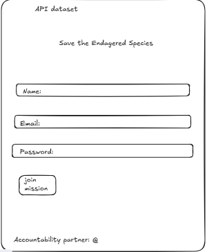

## Save The Wildlife

## The Problem

Unfortunately, a few endagered species are on the verge of extinction in Canada.  There are different classifications and conservation statuses for each unprotected animal.  Find out more as a passtionate animal lover to see how one can participate to save our beloved animals from extinction. 

Endagered Species of Canada

		1.  Which species is the most endangered?
		2.  What are some of the relative locations of the animals?(A few answer this question in the "Common Name" data.
		3.  What are ways to help rescue the life forms?
		
## Wireframe

		
## Links

- Live: https://miaya-dennis.github.io/capstone/
- Repo: https://github.com/miaya-dennis/capstone

## Team

Accountability partner: @GbengaOlagunju

## What Changed?
I decided to add another html to my app.  I originally thought I would add my sign-up page as the first page, but I started thinking of new ideas.  I was able to install images into my page so it could be fetched as api data as well. 

## Reflection
I planned to use a button to fetch the API data which I did.  I also added two more buttons to incorporate a set timer.  I added this feature to help the user find out which specific animal they could  potentially donate towards.