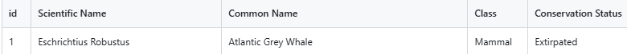

## Save The Wildlife

## The Problem

Unfortunately, Canada have a few endagered species on the verge of extinction.  There are different classifications and conservation statuses for each unprotected animal.  Find out more as a passtionate animal lover to see how one can participate to save our beloved animals from extinction. 

Endagered Species of Canada

		1.  Which classifcation of endangered species is the most threatened?
		2.  What are some of the relative locations of the animals?
		3.  What are ways to help rescue the life forms?
		
## Links

- Live: https://miaya-dennis.github.io/capstone/
- Repo: https://github.com/miaya-dennis/capstone

## Team

Accountability partner: @GbengaOlagunju

